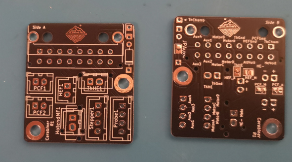
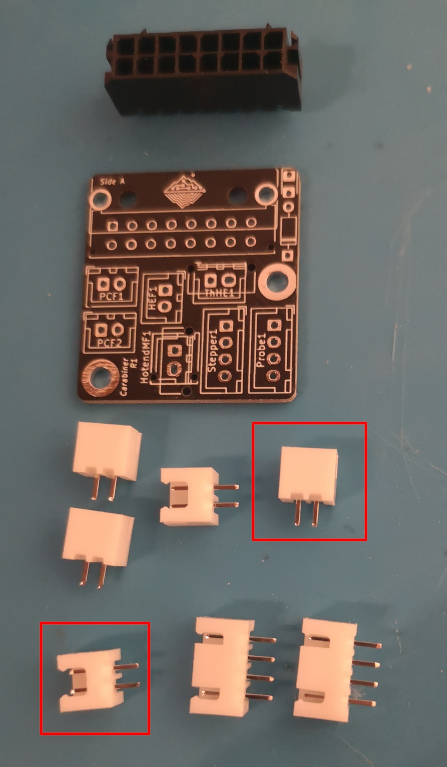
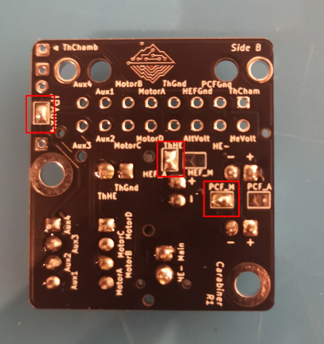
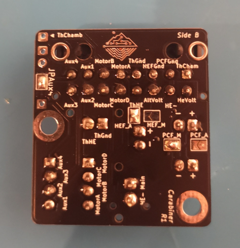
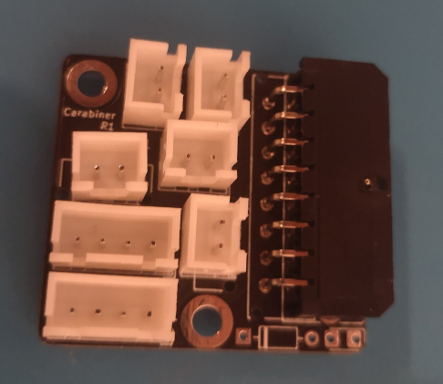

# Build Guide

This build guide is showing how to solder together your Carabiner.  
It's only showing how to assemble a regular Carabiner PCB, however all current 
and future variants of the carabiner should be similar in how to assemble them.

## Step 1 - Choose a side

Your Carabiner PCB should be marked with 'Side A' and 'Side B' on either the left or right top.
While you can install the 16-pin microfit connector on either side, we recommend putting it on 'Side A' as shown in this build-guide to be compatible with most versions of the carabiner.

:x: | If you use one carabiner PCB on your toolhead and one on your controller side, make sure that the connector is installed on the same Side for both PCBs!
:---: | :---
:information_source: | __It is recommended to install your microfit on 'Side A' as some variants of the carabiner might support one side only - and this is 'Side A' by default.__

## Step 2 - Connectors, assemble!

The Carabiner PCB uses mostly JST XH connectors with either 2 or 4 pins. However, for the hotend and thermistor (marked in the picture bottom left and top right respectively) you can also choose to use different connectors.  
Please check [this overview for supported connectors](../README.md#connectors--amperage).

## Step 2.1 - (Optional) Chamber Thermistor and BAT-Diode 

This is an optional step.  
If you intend to use the chamber thermistor or a BAT-diode for an inductive Z-probe on the AUX-connection, it is recommended to solder them on now before any connectors are included.

## Step 3 - Soldering the connectors

Solder up all the connectors, excluding the 16-pin microfit.  
Take your time and make sure that all connectors have a good solid connection.

:information_source: | If you're having a hard time with the PCB wobbling when trying to solder on the connectors, we recommend using a printed spacer, around 7mm tall.
:---: | :---

## Step 4 - Power to the fans

It is now time to select the voltage for your fans. Check your hotend fan and partcooling fans respectively. They should both either require your hotend voltage or alt voltage.  
Solder the jumper for the required voltage - in this build-guide the hotend-fan requires the 'altVoltage' while the partcooling-fans require hotend voltage.  
If you did not install a BAT-Diode in Step 2.1 please also solder the JPAux4, shown in the top-right of the image.

:information_source: | Ensure that you select the voltage correctly for the hotend fan as well as the partcooling fans. 
:---: | :---
:warning: | __It is not possible to have your hotend fan or partcooling fan running with a different voltage than HotendVoltage or AltVoltage.__

## Step 5 - Connection established

After all previous steps, it is now time to solder up the 16-pin microfit connector. Place it on the side you want it to have (Side A in this example) and ensure that if latches are present, they click into the PCB.  
Then solder all 16 connections.

If wanted, you can check your soldering connections with a multimeter.  
__Congratulations__, you have now built your very own Carabiner PCB. Be proud of yourself, wire up your carabiner to your controller and __happy printing__

