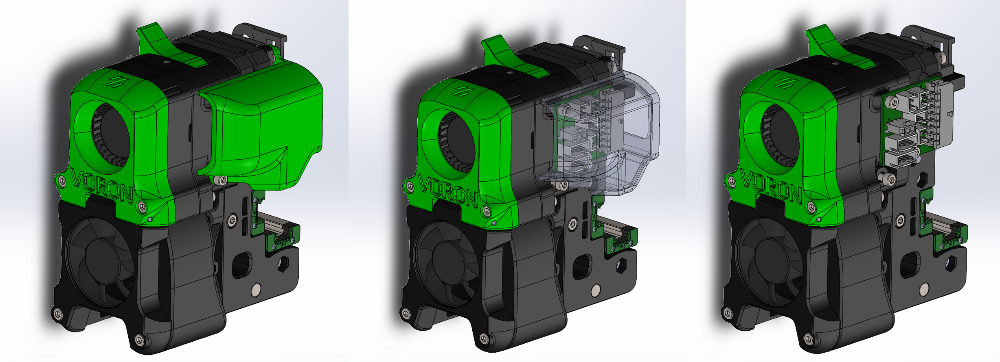

## Carabiner PCB for the Afterburner toolhead

## What is it?
This mod adds support to mount the carabiner PCB directly to the Afterburner Clockwork. This allows you to up you cable management and quickly swap components whenever wanted. A PCB cover is also included when desired and full x and y travel is possible. Additionally the chamber temperature can be measured with the on board thermistor. Many safety calculations have been done on the PCB to ensure safe operation within a closed chamber. For the max current on each channel check the [table](https://github.com/Annex-Engineering/Annex_Engineering_PCBs/tree/master/carabiner-toolboard). 

## Hardware needed:
- 3x M3x5x4 heatinserts
- 3x DIN912 M3x6

## Resources
Carabiner: https://github.com/Annex-Engineering/Annex_Engineering_PCBs/tree/master/carabiner-toolboard

## Discord
Do you have any design suggestions or ideas? We would love to hear! You can join us at https://discord.gg/MzTR3zE

