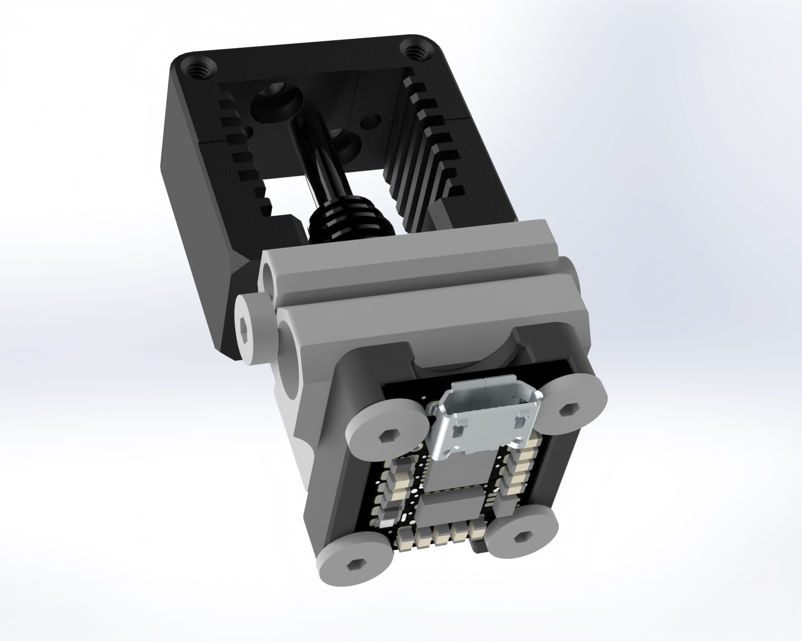

# Crampon

A miniature USB ADXL345 board meant for Klipper InputShaper tuning at the nozzle location.



## Features

- ADXL345 and STM32F042K or STM32L4x2K
- Micro-USB power and data
- Mountable with ADXL toward or away from heater block.
- Screw alignment cutouts for M3

## Crampon Anchor Firmware

Crampon now supports an alternate firmware written with [Anchor](https://github.com/Annex-Engineering/anchor) in Rust. Details on using it can be found on the github repo for [crampon_anchor](https://github.com/Annex-Engineering/crampon_anchor).

## Building Klipper MCU

Crampon requires a minor SPI bus remapping that can not be mainlined at the moment. The recommended build method is to clone a new klipper repo with the changes and build outside of your main klipper install.

```
cd ~
git clone https://github.com/Annex-Engineering/klipper klipper_crampon
cd klipper_crampon
git checkout work-crampon-release-20220914
```

### Configure and build

```
make menuconfig
```
```
                        Klipper Firmware Configuration
[*] Enable extra low-level configuration options
    Micro-controller Architecture (STMicroelectronics STM32)  --->
    Processor model (STM32L412)  --->
    Bootloader offset (No bootloader)  --->
    Clock Reference (Internal clock)  --->
    Communication interface (USB (on PA11/PA12))  --->
    USB ids  --->
()  GPIO pins to set at micro-controller startup
```
> :warning: USB will not enumerate if Clock Reference is misconfigured. You will have to manually enter bootloader by following the Hardware Bootloader instructions below.
```
make
```

### Program

```
make flash FLASH_DEVICE=/dev/serial/by-id/usb-Klipper_...
```
or
```
make flash FLASH_DEVICE=0483:df11
```
if the bootloader is already active.

## Configuring Klipper

An example configuration is provided in the repo at
[config/sample-crampon.cfg](config/sample-crampon.cfg)
In most cases, only the `serial: /dev/serial/by-id/usb-Klipper...` line will need to be updated.

## Hardware Bootloader Entry

If there is an issue with the programmed firmware build, or the device becomes bricked for another reason, there is a hardware override.

Short the through hole pins labelled 'B' for bootloader, with tweezers or similar, while inserting the USB cable.

The bootloader should identify itself in `dmesg`.
## Renders

 
 
